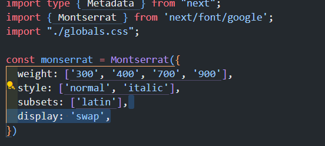
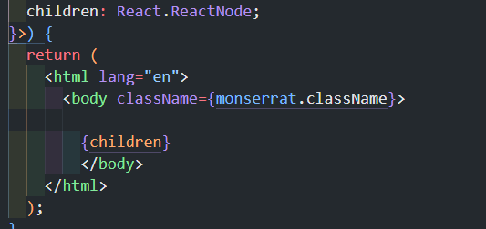
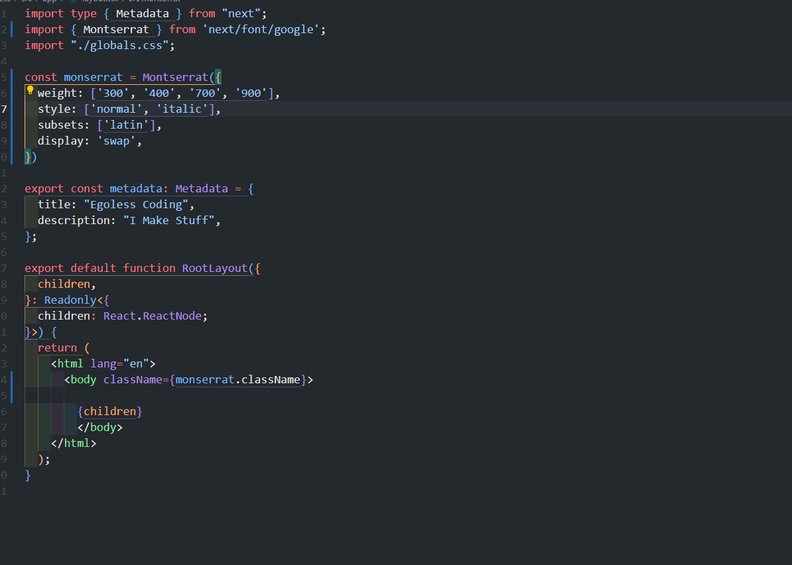
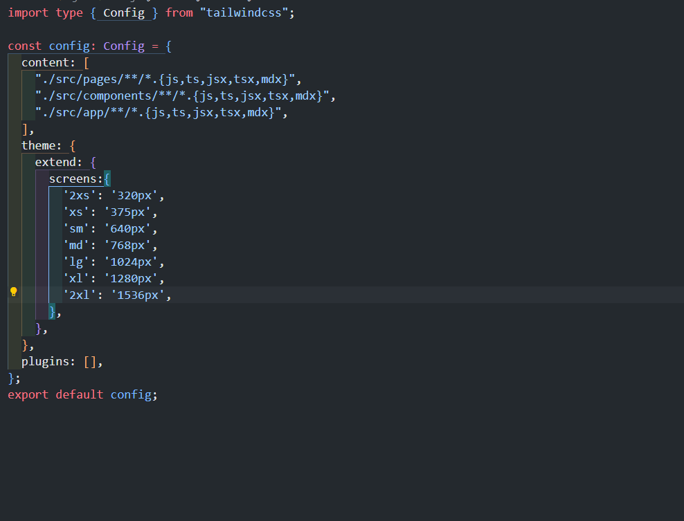
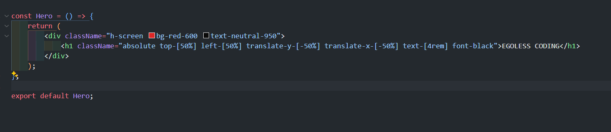
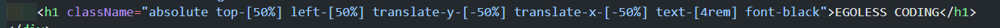

# personal_portfolio_website_EGOLESS_CODER
 This is my personal website

I'm just writing things down (things I know, and things I didn't know.)

This readMe will be treated like my thought flow.

## First I deleted things I needed to delete.

Then I've used built in next/google to 

import font 

This is great for optimasaiton. 

### This is what my src/app/layout.tsx looks like
===

## tailwind.config

I added responsivness.

## hero/page.tsx

I also found out that after top-50% left-50% you need to translate x: -50% y:-50%

to center with position:absoulte 

