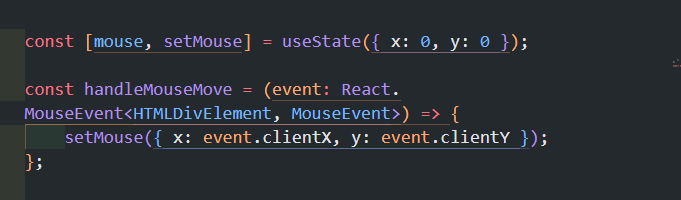
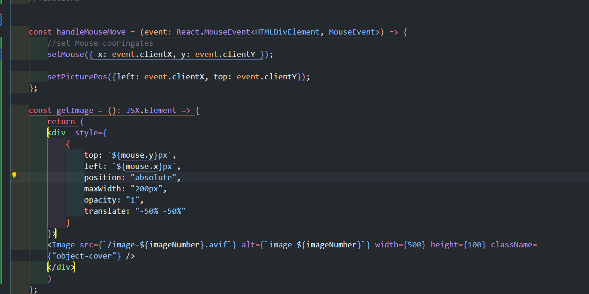

# personal_portfolio_website_EGOLESS_CODER
 This is my personal website

I'm just writing things down (things I know, and things I didn't know.)

This readMe will be treated like my thought flow.

## First I deleted things I needed to delete.

Then I've used built in next/google to 

import font 

This is great for optimasaiton. 

### This is what my src/app/layout.tsx looks like
===

## tailwind.config

I added responsivness.

## hero/page.tsx

I also found out that after top-50% left-50% you need to translate x: -50% y:-50%

to center with position:absoulte 

To start off picture mouse trail, I have downloaded 12 images.

Now for optimisaiton, I'm going to use built in Image tag 

https://nextjs.org/docs/pages/api-reference/components/image

all you need to do is put images in your public folder.

You also need to give it width and height

Mouse Image trail 

I started off getting the coordinates of X-axis and Y-axis.

This is my pesuedo code.

= every .5 second, I want pictures to pop out based on the cordinates.
= If it reaches 12th element of the image, It goes back to 0 element.

So far This is what I created. 

I just wanted to see if the picture is following the mouse cursor.

I created a function where it calculates the 

